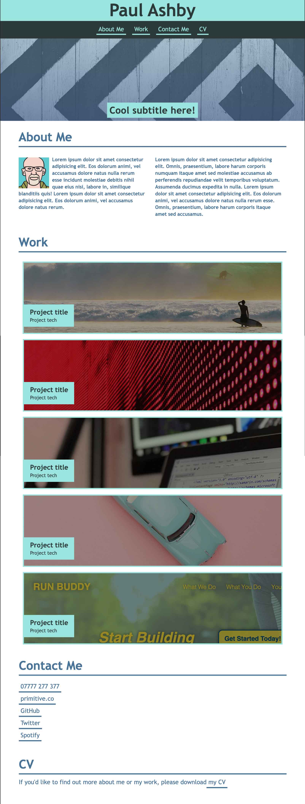

# personal-portfolio

This task was set as part of [the Trilogy Skills Bootcamp in Front-End Web Development](https://skillsforlife.edx.org/coding/frontend/landing/?s=Google-Unbranded&pkw=web%20design%20training&pcrid=624628533241&pmt=p&utm_source=google&utm_medium=cpc&utm_campaign=GGL%7CSKILLS-FOR-LIFE%7CSEM%7CCODING%7C-%7COFL%7CTIER-1%7CALL%7CNBD-G%7CBMM%7CPrimary%7CSubject-Matter&utm_term=web%20design%20training&s=google&k=web%20design%20training&utm_adgroupid=140443158663&utm_locationphysicalms=1006886&utm_matchtype=p&utm_network=g&utm_device=c&utm_content=624628533241&utm_placement=&gclid=Cj0KCQjwqc6aBhC4ARIsAN06NmMdwBRSe3BLeaChkukN5Bbqb18220k1ku9TB2o9tzsX0xYUc-dlRWgaAuyvEALw_wcB&gclsrc=aw.ds). The starter files we were provided can be viewed in [this commit](https://github.com/paulashby/personal-portfolio/tree/9cffc8f504627d52ed6d16a7ca5a633b29192f44). This exercise is likely to become an ongoing project, showcasing the work completed as part of the course. The acceptance criteria for the project were:

* When the page is loaded the page presents your name, a recent photo or avatar, and links to sections about you, your work, and how to contact you
* When one of the links in the navigation is clicked then the UI scrolls to the corresponding section
* When viewing the section about your work then the section contains titled images of your applications
* When presented with the first application then that application's image should be larger in size than the others
* When images of the applications are clicked then the user is taken to that deployed application
* When the page is resized or viewed on various screens and devices then the layout is responsive and adapts to my viewport

For the purposes of the exercise, the project links point at [the Primitive website](https://primitive.co) which is my own current online presence.

[The project](https://paulashby.github.io/personal-portfolio) has been deployed on GitHub Pages.

## Installation

If for any reason you would like to deploy the website yourself, simply fork this repository, go to the Settings page of your fork on GitHub, select <kbd>Pages</kbd> and set the <kbd>Branch</kbd> dropdown to <kbd>main</kbd>.

## Usage

If you wish to use this layout to promote yourself or your business, you can update your forked version (see [Installation](#installation)) with your own content. Alternatively, you can visit [my deployed site](https://paulashby.github.io/personal-portfolio) to see the page in action.

## Credits
Thanks to [the Trilogy Skills Bootcamp in Front-End Web Development](https://skillsforlife.edx.org/coding/frontend/landing/?s=Google-Unbranded&pkw=web%20design%20training&pcrid=624628533241&pmt=p&utm_source=google&utm_medium=cpc&utm_campaign=GGL%7CSKILLS-FOR-LIFE%7CSEM%7CCODING%7C-%7COFL%7CTIER-1%7CALL%7CNBD-G%7CBMM%7CPrimary%7CSubject-Matter&utm_term=web%20design%20training&s=google&k=web%20design%20training&utm_adgroupid=140443158663&utm_locationphysicalms=1006886&utm_matchtype=p&utm_network=g&utm_device=c&utm_content=624628533241&utm_placement=&gclid=Cj0KCQjwqc6aBhC4ARIsAN06NmMdwBRSe3BLeaChkukN5Bbqb18220k1ku9TB2o9tzsX0xYUc-dlRWgaAuyvEALw_wcB&gclsrc=aw.ds) for providing the initial files and dreaming up the exercise. Thanks also to Philip Howley, the course Instructor and Brooke Love, my personal teaching assistant.

## License
Licensed under the [MIT](https://github.com/paulashby/personal-portfolio/blob/main/LICENSE) license.

